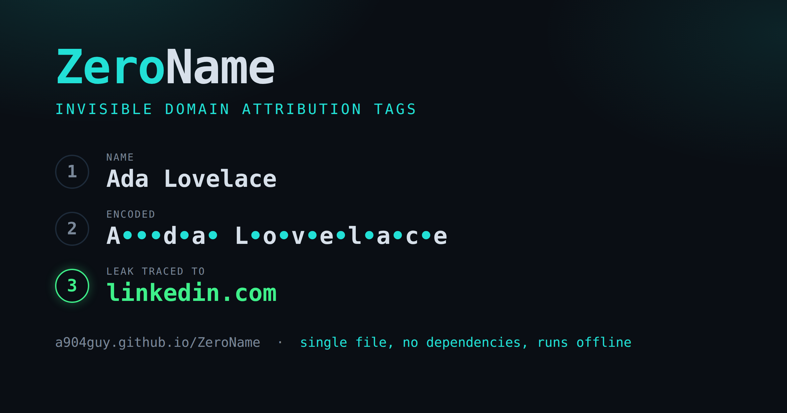

# ZeroName

Invisible domain attribution tags.

ZeroName hides a website's domain inside a visible name using invisible Unicode
codepoints. You enter your name and the site you are giving it to, and it returns a name
that looks the same on screen but contains a hidden, passphrase-keyed payload. If that name
later shows up in spam or a breach dump, paste it into the decoder to see which site leaked
it. The domain is stored in the tag, so there is no database or lookup table to maintain.

It is a single `index.html` file: HTML, CSS, and vanilla JavaScript, with no frameworks,
build step, or external requests. Open the file in a browser to run it.

## Use it

- Hosted: https://a904guy.github.io/ZeroName/
- Local: clone the repo and open `index.html`, or download that one file.

## How the encoding works

1. UTF-8 encode the domain to bytes.
2. Append a checksum byte, the XOR of all domain bytes.
3. Derive a keystream from `SHA-256(passphrase)` (via `crypto.subtle.digest`), cycled
   across the payload.
4. XOR each payload byte with the matching keystream byte.
5. Map each byte to an invisible codepoint: `0–15` to `U+FE00…U+FE0F` (variation
   selectors), `16–255` to `U+E0100 + (byte − 16)` (variation selectors supplement).

The invisible characters are placed in the gaps between the visible letters, never before
the first letter and never after the last. They are spread evenly across those gaps, so
hidden character `k` is attached to the letter at `floor(k × gaps ÷ payload)`. Encoding
`linkedin` into `Noah` places three invisible bytes in each gap, giving `N•••o•••a•••h`.
The placement is monotonic, so the hidden characters stay in payload order. Decoding reads
the string by codepoint, collects the two invisible ranges in order, and decodes that
sequence, so the position of a byte in the name does not matter. A name needs at least two
visible characters to have a gap; if it has only one, the payload is appended after it.
There is a single copy of the payload, so if any hidden character is lost, the checksum
fails.

The passphrase is optional. A blank passphrase produces an obfuscated but unkeyed tag.

## Caveats

ZeroName is an attribution tool. It does not provide encryption or security. The cipher is a
repeating-keystream XOR and the scheme is public. The tag survives only where text is kept exactly as entered,
such as email greeting lines, CRM notes, and breach dumps. NFKC normalization, strict input
validation, OCR, and retyping all destroy it. Treat a decoded domain as an indication of a
likely leak source rather than proof.

## Star it

If you find ZeroName neat or useful, please [star the repo](https://github.com/a904guy/ZeroName)
so other people can find it.

## License

MIT. See [LICENSE](LICENSE).

## Credit

Created by Andy Hawkins, [Hawkins.Tech](https://hawkins.tech)
